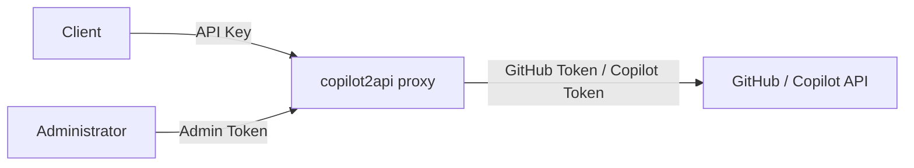
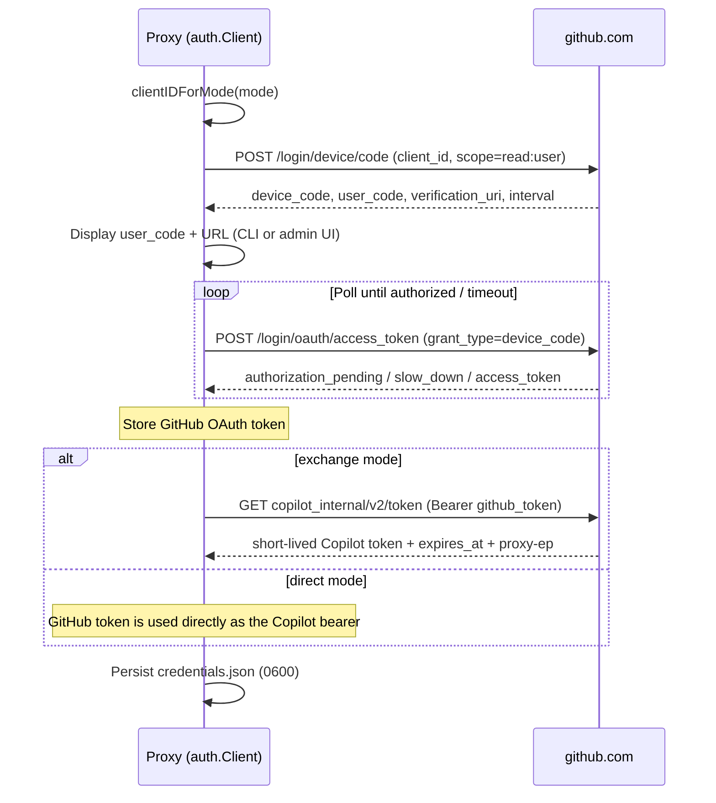
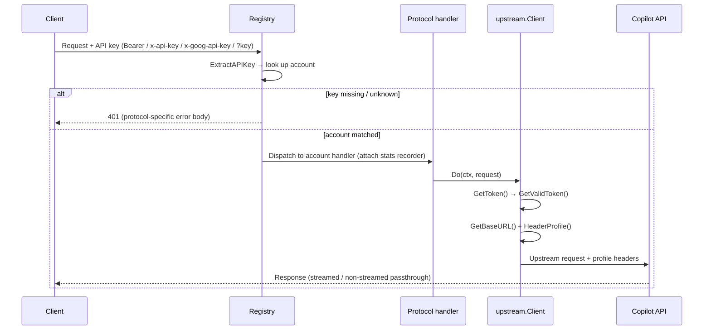

# Authentication Flow

[English](auth-flow.md) | [简体中文](auth-flow.zh-CN.md)

This document describes how authentication works end-to-end in copilot2api, from
the API key a client presents to the credentials the proxy uses to call the
GitHub Copilot backend.

## Two authentication boundaries

- **Downstream** — client → proxy, validated by an API key.
- **Upstream** — proxy → GitHub / Copilot, established by a GitHub Device Flow
  login and then used per request.

## Configuration & environment variables

| Key / field | Purpose |
|-------------|---------|
| `accounts.json` (`id`, `api_key`, `token_dir`, `auth_mode`) | Per-account API key ↔ GitHub account mapping |
| `COPILOT2API_ACCOUNTS_FILE` | Path to `accounts.json` (default `<token-dir>/accounts.json`) |
| `COPILOT2API_AUTH_MODE` | Global default auth mode (`exchange` / `direct`) when an account omits it |
| `COPILOT2API_ADMIN_TOKEN` | Protects the `/admin/` UI and API when set |
| `COPILOT2API_TOKEN_DIR` | Base directory for per-account credential stores (default `~/.config/copilot2api`) |

Each account has an API key of the form `sk-` + 32 base62 characters
(`GenerateAPIKey`, `internal/accounts/keygen.go`). Credentials are persisted per
account in `<token_dir>/credentials.json` with `0600` permissions
(`auth/storage.go`).

## Flow 1 — Startup initialization

Source: `accounts_wire.go` (`buildRegistry` / `buildAccount`), `main.go`.

1. Load `accounts.json`; if it does not exist, an empty config is created and the
   proxy runs in **multi-account mode** (the admin UI is enabled out of the box).
2. For each account, `newAccountHandlers` builds an isolated auth client, models
   cache, and per-protocol handlers (OpenAI / Anthropic / Gemini / Usage).
3. `EnsureAuthenticated` runs `RunDeviceFlowIfNeeded` — the interactive Device
   Flow is performed at startup only for accounts with no stored GitHub token —
   then verifies a usable token via `GetValidToken`.
4. The admin `Manager` is created, reading `COPILOT2API_ADMIN_TOKEN`, and mounted
   at `/admin/`.

> Login only happens at startup or via the admin UI — never during request
> serving, since the Device Flow blocks waiting for user interaction.

## Flow 2 — GitHub Device Flow login (mode-specific client id)

Source: `auth/device_flow.go`, `auth/client.go`, `auth/web_flow.go`.

The Device Flow selects the GitHub client id by auth mode:

| Mode | Client ID | Kind |
|------|-----------|------|
| `exchange` (default) | `Iv1.b507a08c87ecfe98` | GitHub Copilot app |
| `direct` | `Ov23li8tweQw6odWQebz` | OAuth App |

Notes:

- The OAuth scope `read:user` is sent for **both** modes.
- Polling honors GitHub's `slow_down` (increase interval by 5s) and continues on
  `authorization_pending`.

## Flow 3 — Request-time authentication

Source: `internal/accounts/registry.go`, `internal/upstream/client.go`,
`internal/copilot/headers.go`.

**API key extraction** (`ExtractAPIKey`) supports, in order: `Authorization:
Bearer <key>`, `x-api-key`, `x-goog-api-key`, and the `?key=` query parameter —
covering OpenAI, Anthropic, and Gemini clients. A missing key yields
`401 Missing API key`; an unknown key yields `401 Invalid API key`, formatted per
protocol (OpenAI / Anthropic / Gemini).

**Token acquisition** (`GetValidToken`):

- **direct** — returns the raw GitHub token as the Copilot bearer; base URL is
  static.
- **exchange** — returns a cached Copilot token when it is still usable
  (> 5 minutes to expiry); otherwise refreshes via `copilot_internal/v2/token`,
  serialized by `refreshMu` so concurrent requests trigger only one refresh.

## Token modes compared

| Aspect | `exchange` (default) | `direct` |
|--------|----------------------|----------|
| Copilot bearer | Short-lived token from `copilot_internal/v2/token` | Raw GitHub OAuth token |
| Refresh | Auto (5-minute usability window) | None |
| Base URL | Dynamic, from the token's `proxy-ep` (default `https://api.individual.githubcopilot.com`) | Static `https://api.githubcopilot.com` |
| Header profile | `editor` | `opencode` |
| Device Flow client id | `Iv1.b507a08c87ecfe98` | `Ov23li8tweQw6odWQebz` |

## Outbound header profiles

Source: `internal/copilot/headers.go` (`AddHeadersProfile`).

| Profile | Mode | Key headers |
|---------|------|-------------|
| `editor` (default) | exchange | `User-Agent: GitHubCopilotChat/0.39.0`, `Editor-Version`, `Editor-Plugin-Version`, `Copilot-Integration-Id: vscode-chat`, `Openai-Intent: conversation-agent`, `X-Github-Api-Version: 2026-06-01`, generated `X-Request-Id` |
| `opencode` | direct | `User-Agent: opencode/<version>`, `Openai-Intent: conversation-edits`, `X-Github-Api-Version: 2026-06-01`, `X-Initiator: user`; **no** VS Code identity headers and **no** `X-Request-Id` |

## Flow 4 — Token refresh (exchange only)

- `CopilotToken.IsTokenUsable` treats a token as usable when it has more than
  5 minutes before expiry.
- Refresh is lazy: it happens on demand during a request when the cached token is
  stale. Direct mode never refreshes.
- As long as `credentials.json` holds a GitHub token, a Copilot token can be
  re-minted after a restart without re-running the Device Flow.

## Flow 5 — Admin UI web-driven login

Source: `internal/accounts/manager.go`.

1. `POST /admin/api/accounts/{id}/auth/start` calls `StartDeviceFlow`, returns
   `user_code` / `verification_uri`, and runs `CompleteDeviceFlow` in the
   background.
2. `GET /admin/api/accounts/{id}/auth/status` is polled for
   `authenticated` / `pending` / `error`.
3. All `/admin/*` routes are optionally gated by `COPILOT2API_ADMIN_TOKEN`,
   provided as the `X-Admin-Token` header or the `?admin_token=` query parameter.
   When the variable is unset, the admin UI is **not** protected.

Relevant admin endpoints:

| Method & path | Purpose |
|---------------|---------|
| `GET /admin/` | Admin UI |
| `GET/POST /admin/api/accounts` | List / create accounts |
| `PUT/DELETE /admin/api/accounts/{id}` | Update / delete account |
| `POST /admin/api/accounts/{id}/auth/start` | Start Device Flow |
| `GET /admin/api/accounts/{id}/auth/status` | Poll auth status |
| `GET /admin/api/accounts/{id}/tokens` | Inspect stored tokens |
| `GET /admin/api/accounts/{id}/models` | List upstream models for the account |
| `GET /admin/api/generate-key` | Generate an API key |
| `GET/DELETE /admin/api/stats[/ {id}]` | Token-usage stats |

## Summary

A client presents an API key that resolves to an account; the account's
`auth_mode` decides whether the proxy uses `Iv1.b507a08c87ecfe98` (exchange —
mint a short-lived Copilot token, `editor` headers) or `Ov23li8tweQw6odWQebz`
(direct — use the GitHub token as-is, `opencode` headers). The matching bearer
and headers are injected and the request is forwarded to the Copilot API. Login
is always via the GitHub Device Flow (at startup or through the admin UI), and
credentials are stored per account in an isolated `credentials.json`.
