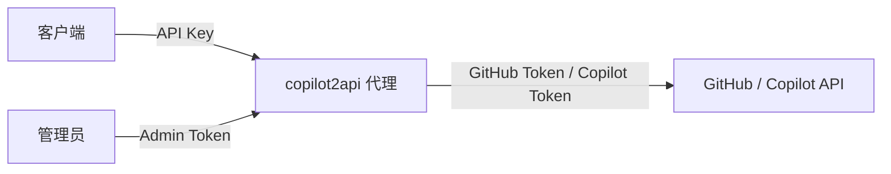
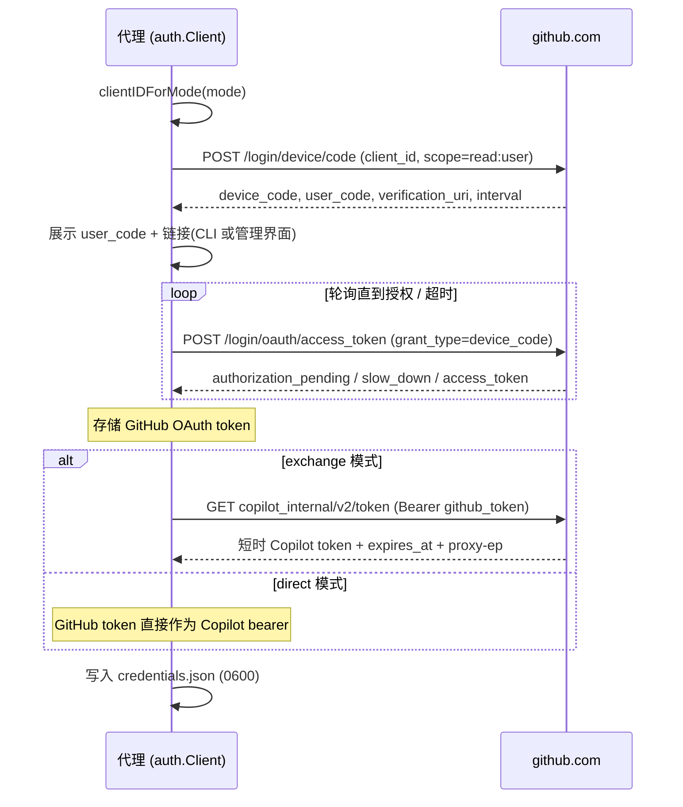
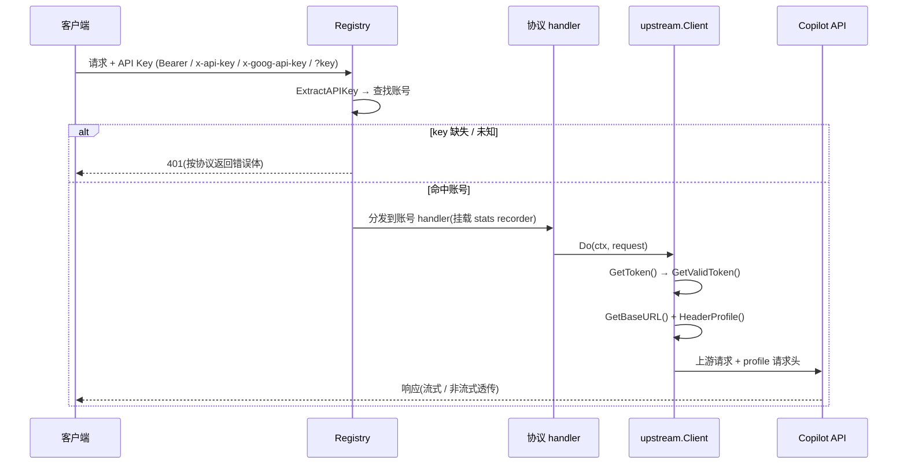

# 认证流程

[English](auth-flow.md) | [简体中文](auth-flow.zh-CN.md)

本文档端到端说明 copilot2api 的认证机制:从客户端出示的 API Key,到代理调用
GitHub Copilot 后端所使用的凭据。

## 两个认证边界

- **下游** —— 客户端 → 代理,通过 API Key 校验。
- **上游** —— 代理 → GitHub / Copilot,先由 GitHub Device Flow 登录建立,随后每次
  请求使用。

## 配置与环境变量

| 键 / 字段 | 作用 |
|-----------|------|
| `accounts.json`(`id`、`api_key`、`token_dir`、`auth_mode`) | 按账号的 API Key ↔ GitHub 账号映射 |
| `COPILOT2API_ACCOUNTS_FILE` | `accounts.json` 路径(默认 `<token-dir>/accounts.json`) |
| `COPILOT2API_AUTH_MODE` | 账号未指定时的全局默认认证模式(`exchange` / `direct`) |
| `COPILOT2API_ADMIN_TOKEN` | 设置后保护 `/admin/` 界面与 API |
| `COPILOT2API_TOKEN_DIR` | 各账号凭据存储的基础目录(默认 `~/.config/copilot2api`) |

每个账号的 API Key 形如 `sk-` + 32 位 base62 字符(`GenerateAPIKey`,
`internal/accounts/keygen.go`)。凭据按账号持久化到
`<token_dir>/credentials.json`,权限为 `0600`(`auth/storage.go`)。

## 流程一 —— 启动初始化

源码:`accounts_wire.go`(`buildRegistry` / `buildAccount`)、`main.go`。

1. 加载 `accounts.json`;若不存在则创建空配置,代理进入**多账号模式**(管理界面
   开箱即用)。
2. 对每个账号,`newAccountHandlers` 构建独立的 auth client、models 缓存与各协议
   handler(OpenAI / Anthropic / Gemini / Usage)。
3. `EnsureAuthenticated` 执行 `RunDeviceFlowIfNeeded` —— 仅对无已存 GitHub token
   的账号在启动时进行交互式 Device Flow —— 再通过 `GetValidToken` 校验可用 token。
4. 创建 admin `Manager`(读取 `COPILOT2API_ADMIN_TOKEN`)并挂载到 `/admin/`。

> 登录只发生在启动时或通过管理界面,绝不会在请求处理过程中触发,因为 Device Flow
> 会阻塞等待用户交互。

## 流程二 —— GitHub Device Flow 登录(按模式选 client id)

源码:`auth/device_flow.go`、`auth/client.go`、`auth/web_flow.go`。

Device Flow 按认证模式选择 GitHub client id:

| 模式 | Client ID | 类型 |
|------|-----------|------|
| `exchange`(默认) | `Iv1.b507a08c87ecfe98` | GitHub Copilot 应用 |
| `direct` | `Ov23li8tweQw6odWQebz` | OAuth App |

说明:

- OAuth scope `read:user` 对**两种**模式都发送。
- 轮询遵循 GitHub 的 `slow_down`(间隔 +5 秒),遇 `authorization_pending` 继续。

## 流程三 —— 请求时认证

源码:`internal/accounts/registry.go`、`internal/upstream/client.go`、
`internal/copilot/headers.go`。

**API Key 提取**(`ExtractAPIKey`)按顺序支持:`Authorization: Bearer <key>`、
`x-api-key`、`x-goog-api-key`、以及 `?key=` 查询参数 —— 覆盖 OpenAI、Anthropic 与
Gemini 客户端。缺失 key 返回 `401 Missing API key`;未知 key 返回
`401 Invalid API key`,并按协议(OpenAI / Anthropic / Gemini)格式化。

**Token 获取**(`GetValidToken`):

- **direct** —— 直接返回原始 GitHub token 作为 Copilot bearer;base URL 为静态。
- **exchange** —— 缓存 token 仍可用(距过期 > 5 分钟)时直接返回;否则通过
  `copilot_internal/v2/token` 刷新,并由 `refreshMu` 串行化,使并发请求只触发一次
  刷新。

## Token 模式对比

| 维度 | `exchange`(默认) | `direct` |
|------|-------------------|----------|
| Copilot bearer | 来自 `copilot_internal/v2/token` 的短时 token | 原始 GitHub OAuth token |
| 刷新 | 自动(5 分钟可用窗口) | 无 |
| Base URL | 动态,来自 token 的 `proxy-ep`(默认 `https://api.individual.githubcopilot.com`) | 静态 `https://api.githubcopilot.com` |
| 请求头 profile | `editor` | `opencode` |
| Device Flow client id | `Iv1.b507a08c87ecfe98` | `Ov23li8tweQw6odWQebz` |

## 出站请求头 profile

源码:`internal/copilot/headers.go`(`AddHeadersProfile`)。

| Profile | 模式 | 关键请求头 |
|---------|------|-----------|
| `editor`(默认) | exchange | `User-Agent: GitHubCopilotChat/0.39.0`、`Editor-Version`、`Editor-Plugin-Version`、`Copilot-Integration-Id: vscode-chat`、`Openai-Intent: conversation-agent`、`X-Github-Api-Version: 2026-06-01`、生成 `X-Request-Id` |
| `opencode` | direct | `User-Agent: opencode/<version>`、`Openai-Intent: conversation-edits`、`X-Github-Api-Version: 2026-06-01`、`X-Initiator: user`;**不含** VS Code 标识头,**不含** `X-Request-Id` |

## 流程四 —— Token 刷新(仅 exchange)

- `CopilotToken.IsTokenUsable` 在距过期超过 5 分钟时视为可用。
- 刷新为惰性:仅在请求时发现缓存 token 过期才进行。direct 模式从不刷新。
- 只要 `credentials.json` 中存有 GitHub token,重启后即可重新铸造 Copilot token,
  无需再次执行 Device Flow。

## 流程五 —— 管理界面网页驱动登录

源码:`internal/accounts/manager.go`。

1. `POST /admin/api/accounts/{id}/auth/start` 调用 `StartDeviceFlow`,返回
   `user_code` / `verification_uri`,并在后台运行 `CompleteDeviceFlow`。
2. 轮询 `GET /admin/api/accounts/{id}/auth/status` 获取
   `authenticated` / `pending` / `error`。
3. 所有 `/admin/*` 路由可选地由 `COPILOT2API_ADMIN_TOKEN` 保护,以 `X-Admin-Token`
   头或 `?admin_token=` 查询参数提供。未设置该变量时,管理界面**不受保护**。

相关 admin 端点:

| 方法与路径 | 作用 |
|-----------|------|
| `GET /admin/` | 管理界面 |
| `GET/POST /admin/api/accounts` | 列出 / 创建账号 |
| `PUT/DELETE /admin/api/accounts/{id}` | 更新 / 删除账号 |
| `POST /admin/api/accounts/{id}/auth/start` | 启动 Device Flow |
| `GET /admin/api/accounts/{id}/auth/status` | 轮询认证状态 |
| `GET /admin/api/accounts/{id}/tokens` | 查看已存 token |
| `GET /admin/api/accounts/{id}/models` | 列出该账号的上游模型 |
| `GET /admin/api/generate-key` | 生成 API Key |
| `GET/DELETE /admin/api/stats[/{id}]` | Token 用量统计 |

## 总结

客户端出示 API Key 解析到某账号;账号的 `auth_mode` 决定代理使用
`Iv1.b507a08c87ecfe98`(exchange —— 铸造短时 Copilot token、`editor` 请求头)还是
`Ov23li8tweQw6odWQebz`(direct —— 直接使用 GitHub token、`opencode` 请求头)。随后
注入对应的 bearer 与请求头,并将请求转发到 Copilot API。登录统一走 GitHub Device
Flow(启动时或通过管理界面),凭据按账号存储在各自独立的 `credentials.json` 中。
