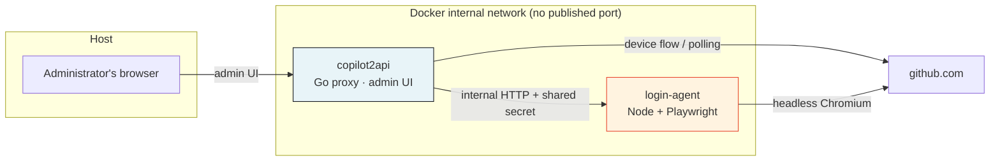
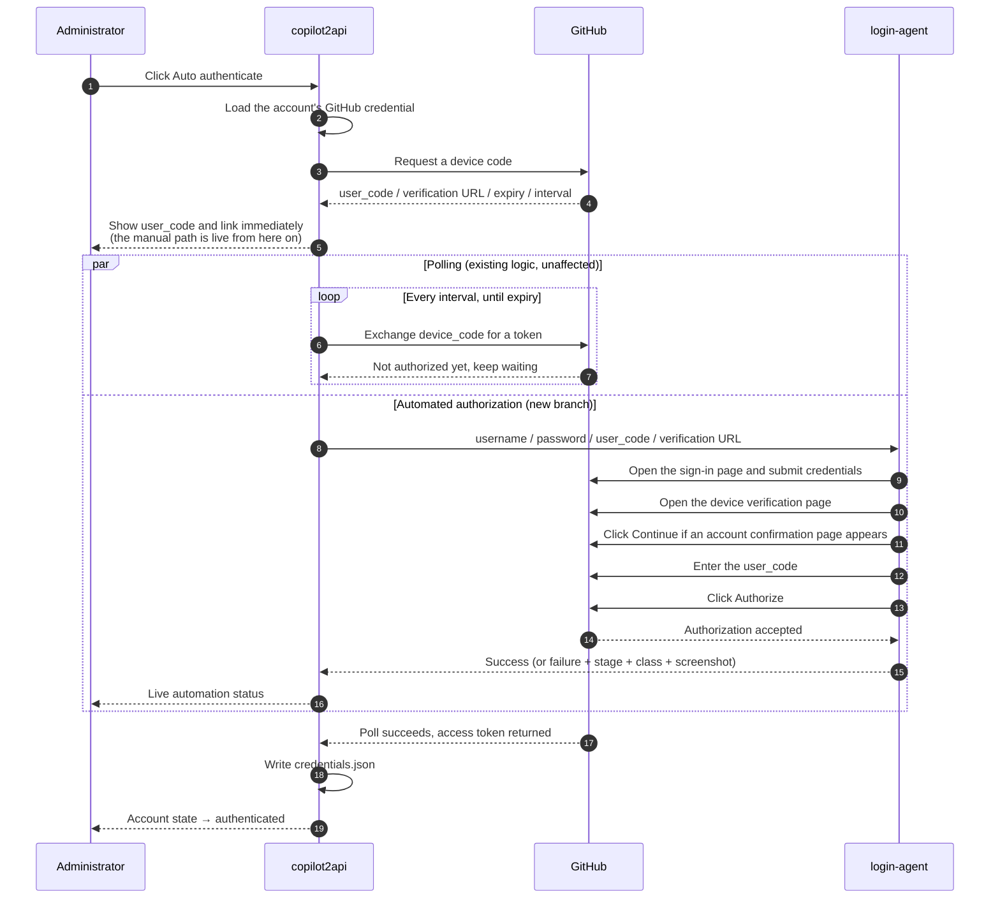
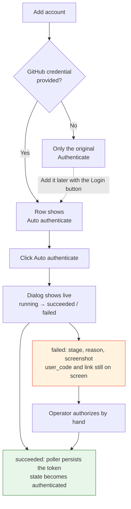
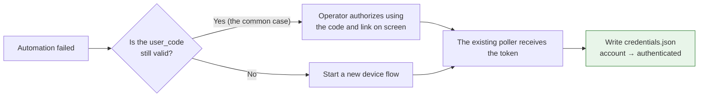

# Automated Login: Design and Business Flow

[English](auto-login-design.md) | [简体中文](auto-login-design.zh-CN.md)

> This document covers the **design and the business flow only** — not a list of code changes.
> For deployment and configuration see [auto-login.md](auto-login.md).
> For the full authentication chain (downstream API-key validation, token refresh) see [auth-flow.md](auth-flow.md).

---

## 1. The problem

copilot2api obtains each account's upstream credential through the GitHub Device Flow. That flow is designed around a human being present:

1. The proxy requests a device code and receives a `user_code` (like `ABCD-1234`) plus a verification URL.
2. **A person** opens a browser, signs in to GitHub, types the `user_code`, and clicks **Authorize**.
3. The proxy's poller receives the access token and writes it to the account's credential directory.

Steps 1 and 3 have always been automatic. The only manual step is step 2. That is fine for a single account, but multi-account deployments amplify it:

- Every new account requires opening a browser by hand.
- Tokens expire, so the same ritual repeats.
- Bulk environment setup cannot be scripted end to end.

GitHub does **not** return `verification_uri_complete` (a pre-filled link that carries the code), so the `user_code` **must be typed into the page**. There is no URL trick that bypasses it.

**The conclusion: what needs automating is not "login" — it is "the few clicks a human performs in a browser."** The entire solution is scoped to exactly that.

---

## 2. Design principles

| Principle | What it means |
|-----------|---------------|
| **Purely additive** | Device-flow initiation, polling, and credential persistence are untouched. Automation is an optional branch running alongside them, not a rewrite. |
| **Failure falls back** | A failed automation changes no existing state. The `user_code` stays valid, an operator can finish by hand, and the poller still collects the token. |
| **Off with one switch** | With no agent URL configured the feature disappears entirely: no controls in the admin UI, behavior identical to before. |
| **No browser in the proxy** | Chromium, Playwright, and the Node runtime live in a separate container. The proxy keeps its minimal image and minimal attack surface. |

The first two principles cap the risk: **the worst case equals not having the feature at all.**

---

## 3. System composition



### Responsibilities

| Component | Owns | **Does not own** |
|-----------|------|------------------|
| **copilot2api** | Starting the device flow, polling upstream, persisting the token, managing accounts, storing GitHub credentials, orchestrating the automation | Never drives a browser, never parses GitHub pages |
| **login-agent** | Signing in through a headless browser, entering the `user_code`, clicking Authorize, classifying failures, returning a screenshot | Never touches the access token, never reads or writes the credential directory, knows nothing about account configuration |

This boundary is deliberate: **the agent never sees the resulting token.** It is only "a hand that clicks the mouse" — the authorization result travels from GitHub straight back to the proxy's poller. Even if the agent were compromised, an attacker would obtain the one username/password it was handed for that run, not every account's upstream credential.

### Network boundary

The login agent **publishes no port to the host**. It is reachable only by service name on the compose network, and both sides additionally verify each other with a shared secret sent as a request header. Nothing on the host or the internet can call the agent directly — only the proxy can.

---

## 4. Data and state

### 4.1 Two unrelated credentials

| Data | Contents | Location | Written by | Read by |
|------|----------|----------|-----------|---------|
| **GitHub sign-in credential** | Username + password | `<token_dir>/github_logins.json` (mode `0600`) | The administrator, via the admin UI | The proxy, only when starting an automated run, to hand to the agent |
| **Upstream credential** | GitHub access token | `<token_dir>/credentials.json` | The proxy, after polling succeeds | The proxy, when calling upstream |

Their lifecycles are independent: deleting the sign-in credential does not invalidate an existing token, and an expired token does not touch the sign-in credential. Passwords are never returned by any API and never written to logs.

### 4.2 Two states — do not conflate them

**Account authentication state** (pre-existing, unchanged):

```
pending ──────────────► authenticated
        poller gets token
```

**Automation state** (new, describes only how "the hand" did):

```
idle ──► running ──┬──► succeeded    the browser clicked Authorize
                   └──► failed       with stage + error class + screenshot
```

The important part: **these two are not tightly coupled.**

- `succeeded` does not mean the account is authenticated — it means the authorize page was clicked; the token still arrives via polling.
- `failed` does not mean authentication failed — if the operator finishes by hand, the account still becomes `authenticated`.

The admin UI shows them separately so that on failure it is obvious that a human should take over, rather than suggesting the whole attempt is dead.

---

## 5. Business flow

### 5.1 End-to-end sequence



**The `par` block is the point of the diagram.** Polling and automation are two independent parallel branches. If the automation branch breaks, the polling branch continues untouched — that is "failure falls back," expressed as flow.

### 5.2 Stages inside the agent

Each request advances through a fixed sequence, and the agent always records where it stopped, returning that stage alongside a screenshot on failure:

| Stage | What happens | Notes |
|-------|--------------|-------|
| `launch` | Start the browser context | Each account uses its own **persistent** browser profile |
| `login` | Ensure the session is signed in | If the profile's session is still valid, the sign-in form is skipped entirely |
| `device_code` | Open the verification page and enter the code | Clicks through the "signed in as" confirmation page first, then handles both code-form shapes: one combined input, or one box per character |
| `authorize` | Click Authorize | GitHub deliberately disables this button for a few seconds; the agent waits until it is usable |
| `done` | Complete | GitHub has accepted the authorization; the rest is the proxy's poller |

Two decisions worth calling out:

**Persistent profiles.** Each account reuses its own browser directory, preserving GitHub's session and "trusted device" cookies. Two direct benefits: repeat authorizations skip the sign-in form entirely, and — more importantly — GitHub is far less likely to challenge with an email verification code, since the device is no longer unfamiliar. Once a human clears that challenge one time, it generally stops recurring.

**Serial execution.** The agent processes login requests through a mutex queue, so only one Chromium instance exists at a time. This is a memory and stability trade-off: a batch of accounts **queues** rather than running concurrently. A single authorization typically takes tens of seconds, so budget time proportional to the account count.

### 5.3 The admin UI path



Credentials are **optional**. Leave them blank and you get exactly the original manual flow. Both paths coexist permanently — there is no "once enabled, no way back."

---

## 6. Failure handling and fallback

### 6.1 Failure classification

The agent does not just report "it failed" — it determines *why*, because different causes call for entirely different responses:

| Class | Meaning | What the operator does |
|-------|---------|------------------------|
| `invalid_credentials` | Wrong username or password | Correct the credential and retry |
| `two_factor_required` | The account has 2FA enabled | **Use the manual flow for this account** (see section 8) |
| `device_verification` | GitHub demands an email/device code | Clear it once by hand; the profile then remembers the device |
| `captcha` | A human-verification challenge appeared | Retry later or from a different egress IP |
| `code_rejected` | The page rejected the `user_code` | Usually an expired code — start a new run |
| `timeout` | A page or the run as a whole timed out | Check container networking and egress connectivity |
| `unknown` | Could not be classified | **Look at the screenshot** — usually means GitHub's page structure changed |

Every failure carries **a screenshot of exactly where the browser stopped**. This is the primary diagnostic: without it, debugging a headless browser is mostly guesswork.

### 6.2 Fallback path



There is **nothing new anywhere on this path** — it is precisely the flow that existed before automation was introduced. That is why the design carries no risk for existing deployments: automation simply makes one extra attempt, and hands the wheel back to a human when it does not work.

---

## 7. Security model

| Boundary | Measure |
|----------|---------|
| **Credential storage** | Separate file, mode `0600`, stored apart from tokens; never returned by an API, never logged |
| **Network exposure** | The agent publishes no host port and is internal-only; proxy and agent authenticate each other with a shared secret |
| **Blast radius** | The agent never touches access tokens, the credential directory, or account configuration |
| **Failure artifacts** | Screenshots are returned only through the authenticated admin interface — never persisted, never sent anywhere else |

One trade-off must be stated plainly: **GitHub passwords are stored in plaintext.** Automation has to type a real password into a sign-in form, so any reversible encryption on the same host merely relocates the key rather than protecting anything. The defenses therefore sit elsewhere: file permissions, process isolation, network isolation, and non-disclosure.

The deployment requirements follow directly:

- Treat the host as one that holds GitHub passwords — manage its disks and backups accordingly.
- Always set a long, random admin token; leaving it empty means no authentication at all.
- Prefer **dedicated bot accounts** over personal primary accounts.

---

## 8. Known limits

| Limit | Detail | Mitigation |
|-------|--------|-----------|
| **No two-factor support** | Accounts with 2FA stop with `two_factor_required` | A deliberate trade-off, not a defect: those accounts use the manual flow |
| **Email codes from unfamiliar IPs** | Even without 2FA, GitHub may demand an email code on a new device | Persistent profiles reuse cookies; after one manual pass this rarely recurs |
| **GitHub page changes** | Sign-in and authorization page changes break automation — a risk shared by all browser automation | Page-targeting rules live in one place with fallbacks, and every failure returns a screenshot for fast diagnosis |
| **Serial logins** | Only one browser instance runs at a time | Budget time proportional to the number of accounts |

All four point to the same judgement: **automation handles the normal path; exceptional paths go back to a human.** Better for it to stop clearly and explain itself than to behave unpredictably in a situation it cannot reason about.

---

## 9. Turning it off

Do not configure the agent URL. Then:

- The admin UI renders no automation controls.
- The related endpoints are inert.
- Account configuration is unchanged; no migration is needed.
- Authentication behaves exactly as it did before.

The feature can be switched on and off at any time, leaving nothing behind.
