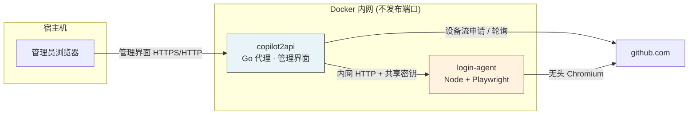
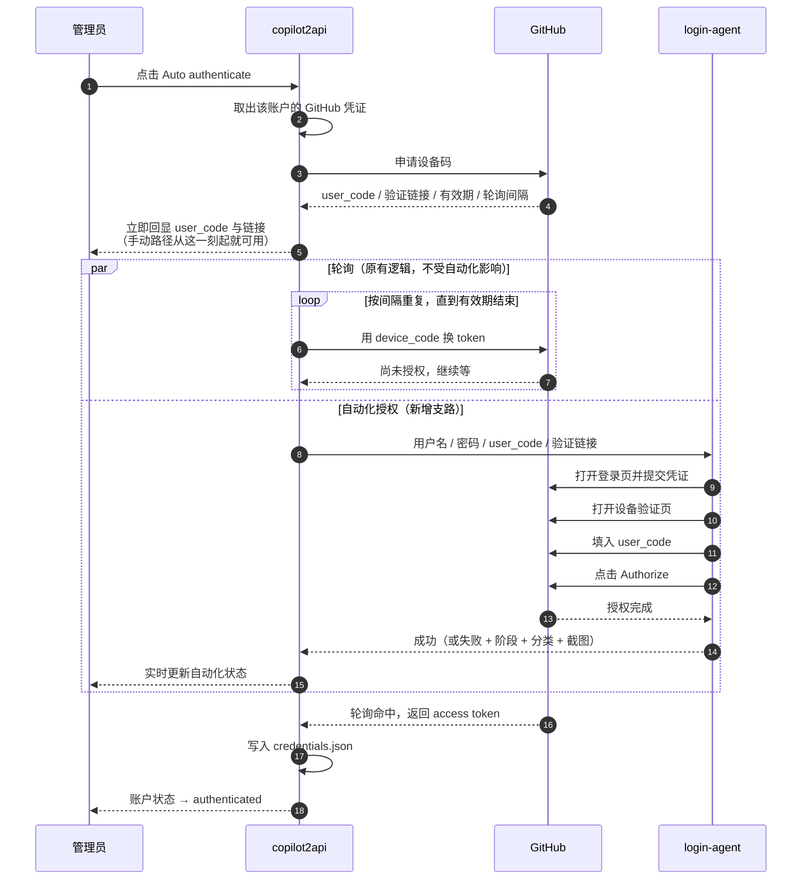
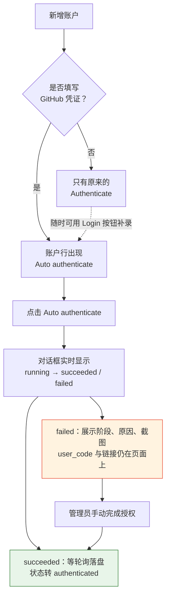
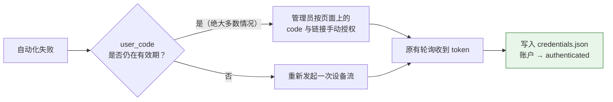

# 自动化登录方案说明

[English](auto-login-design.md) | [简体中文](auto-login-design.zh-CN.md)

> 本文只说明**实现方案与业务流程**，不涉及代码层面的改动清单。
> 部署步骤与配置项见 [auto-login.zh-CN.md](auto-login.zh-CN.md)；
> 完整认证链路（含下游 API Key 校验、token 刷新）见 [auth-flow.zh-CN.md](auth-flow.zh-CN.md)。

---

## 1. 要解决的问题

copilot2api 通过 GitHub Device Flow 获取每个账户的上游凭证。这套流程本身是为「人在场」设计的：

1. 代理向 GitHub 申请设备码，拿到一个 `user_code`（形如 `ABCD-1234`）和验证链接；
2. **人**打开浏览器，登录 GitHub，把 `user_code` 填进去，点击 **Authorize**；
3. 代理侧的轮询拿到 access token，写入该账户的凭证目录。

第 1 步和第 3 步早就是自动的，卡住的只有第 2 步。单账户无所谓，但多账户场景下这一步会被放大：

- 每加一个账户就要人工开一次浏览器；
- token 过期后需要重新授权，运维需要重复同样的动作；
- 批量初始化环境时，这一步无法纳入自动化脚本。

GitHub 的设备流不返回 `verification_uri_complete`（即带 code 的免填链接），所以 `user_code` **必须被输入到页面里**，无法靠拼 URL 绕过。

**结论：需要自动化的不是「登录」，而是「代替人完成浏览器上的那几次点击」。** 整套方案的范围就限定在这里。

---

## 2. 设计原则

| 原则 | 含义 |
|------|------|
| **纯增量** | 设备流的发起、轮询、凭证落盘逻辑保持原样。自动化是叠加在旁边的一条可选支路，不是对原流程的改写。 |
| **失败即回退** | 自动化失败不改变任何既有状态。`user_code` 在有效期内依然可用，管理员随时可以手动完成授权，轮询照样会收到 token。 |
| **可一键关闭** | 不配置 agent 地址时，功能整体静默下线，管理界面不出现任何自动化控件，行为与引入前完全一致。 |
| **浏览器不进代理进程** | 浏览器自动化的依赖（Chromium、Playwright、Node 运行时）全部隔离在独立容器里，代理保持原有的最小镜像与最小攻击面。 |

前两条决定了这套方案的风险上限：**最坏情况等于没有这个功能**。

---

## 3. 系统组成



### 职责划分

| 组件 | 负责 | **不负责** |
|------|------|-----------|
| **copilot2api** | 发起设备流、轮询上游、落盘 token、管理账户、保管 GitHub 凭证、编排自动化 | 不操作浏览器，不解析 GitHub 页面 |
| **login-agent** | 在无头浏览器里登录 GitHub、填入 `user_code`、点击 Authorize、判定失败原因、回传截图 | 不接触 access token，不读写凭证目录，不知道账户配置 |

这条边界是刻意的：**agent 全程看不到最终的 token**。它只是一只「代替人点鼠标的手」，授权结果由 GitHub 直接回到代理的轮询里。即便 agent 被攻破，攻击者拿到的也只是它当次收到的那组用户名密码，而不是代理里所有账户的上游凭证。

### 网络边界

login-agent **不向宿主机发布任何端口**，只在 compose 内网中通过服务名可达。两侧再用一个共享密钥（请求头形式）互相确认身份。也就是说：从宿主机或外网都无法直接调用 agent，只有代理能调它。

---

## 4. 数据与状态

### 4.1 两份互不相干的凭证

| 数据 | 内容 | 位置 | 谁写 | 谁读 |
|------|------|------|------|------|
| **GitHub 登录凭证** | 用户名 + 密码 | `<token_dir>/github_logins.json`（权限 `0600`） | 管理员通过管理界面录入 | 只在发起自动化时，由代理取出发给 agent |
| **上游访问凭证** | GitHub access token | `<token_dir>/credentials.json` | 设备流轮询成功后由代理写入 | 代理向上游发请求时使用 |

两者在生命周期上完全独立：删掉登录凭证不影响已经拿到的 token；token 过期也不会动登录凭证。任何 API 响应都不会返回密码，日志里也不打印。

### 4.2 两个状态，不要混为一谈

**账户认证状态**（原有概念，未变）：

```
pending ──────► authenticated
        轮询拿到 token
```

**自动化执行状态**（新增，仅描述「那只手」干得怎么样）：

```
idle ──► running ──┬──► succeeded    浏览器已点下 Authorize
                   └──► failed       附带失败阶段 + 错误分类 + 截图
```

关键点：**这两个状态没有强绑定。**

- `succeeded` 不代表账户已认证——它只说明授权页被点了，token 仍要等轮询取回；
- `failed` 也不代表账户认证失败——管理员手动完成授权后，账户照样会变成 `authenticated`。

管理界面把两者分开展示，就是为了让运维在失败时清楚「该我接手了」，而不是误以为整件事已经报废。

---

## 5. 业务流程

### 5.1 端到端时序



**这张图里最重要的是那个 `par`**：轮询和自动化是两条并行的独立支路。自动化那条断了，轮询这条毫发无损地继续跑——这正是「失败即回退」在流程上的体现。

### 5.2 agent 内部的执行阶段

agent 收到一次请求后，按固定顺序推进，并始终记录「当前停在哪一步」，失败时连同截图一起回传：

| 阶段 | 做什么 | 说明 |
|------|--------|------|
| `launch` | 启动浏览器上下文 | 按账户使用**独立且持久化**的浏览器 profile |
| `login` | 确认已登录 GitHub | 若 profile 里的会话仍有效，直接跳过登录表单 |
| `device_code` | 打开验证页并填入 code | 兼容「单输入框」与「逐字符输入框」两种页面形态 |
| `authorize` | 点击 Authorize | 该按钮上线后会被 GitHub 主动禁用数秒，需等待其可用 |
| `done` | 完成 | 此时 GitHub 已接受授权，剩下的交给代理的轮询 |

两个值得说明的设计：

**持久化 profile。** 每个账户复用自己的浏览器目录，保留 GitHub 的会话与「受信任设备」cookie。带来两个直接收益：重复授权时可以跳过整个登录表单；更重要的是，能显著降低 GitHub 对陌生设备触发邮箱验证码的概率——第一次人工过一遍之后，后续基本不再触发。

**串行执行。** agent 用互斥队列逐个处理登录请求，同一时刻只有一个 Chromium 实例。这是内存与稳定性的取舍：批量账户是**排队**而非并发。单次授权通常几十秒，批量场景按账户数预留时间即可。

### 5.3 管理界面的使用路径



凭证是**可选**的：不填就是原来的手动流程，两条路径始终并存，不存在「启用后就回不去」的情况。

---

## 6. 异常处理与回退

### 6.1 失败分类

agent 不返回「失败了」三个字，而是判定出具体原因——因为不同原因对应的处置动作完全不同：

| 分类 | 含义 | 管理员该做什么 |
|------|------|---------------|
| `invalid_credentials` | 用户名或密码不对 | 更正凭证后重试 |
| `two_factor_required` | 账户开启了两步验证 | **该账户改走手动流程**（见第 8 节） |
| `device_verification` | GitHub 要求邮箱/设备验证码 | 人工过一次验证，之后 profile 会记住该设备 |
| `captcha` | 触发了人机验证 | 换时间或换出口 IP 重试 |
| `code_rejected` | `user_code` 被页面拒绝 | 通常是 code 已过期，重新发起即可 |
| `timeout` | 页面或整体流程超时 | 检查容器网络与出口连通性 |
| `unknown` | 未能归类 | **看截图**——通常意味着 GitHub 页面结构变了 |

每次失败都会附上**浏览器停住那一刻的截图**。这是排查的核心手段：无头浏览器出问题时，没有截图基本只能靠猜。

### 6.2 回退路径



整条回退路径上**没有任何新东西**——它就是引入自动化之前本来就在跑的流程。这也是为什么这套方案对既有部署是零风险的：自动化只是在原流程之上多试了一次，试不成就把方向盘交还给人。

---

## 7. 安全模型

| 边界 | 措施 |
|------|------|
| **凭证存储** | 独立文件、`0600` 权限，与 token 分开存放；API 不返回、日志不打印 |
| **网络暴露** | agent 不发布宿主端口，仅内网可达；代理与 agent 之间用共享密钥互认 |
| **权限范围** | agent 不接触 access token、不读写凭证目录、不感知账户配置 |
| **失败面** | 失败截图仅经管理接口返回给已鉴权的管理员，不落盘、不外发 |

需要明确承认的取舍：**GitHub 密码是以明文存储的。** 因为自动化必须把真实密码填进登录表单，任何可逆加密在同一台主机上都只是把钥匙换个地方放，不构成实质防护。所以防线放在了别处——文件权限、进程隔离、网络隔离、不外泄。

由此推导出的部署要求也很直接：

- 部署主机按「持有 GitHub 密码的主机」对待，管好磁盘与备份；
- 管理接口的 token 必须设置且足够长（留空等于完全不鉴权）；
- 优先使用**专用的机器人账户**，而不是个人主账户。

---

## 8. 已知边界

| 边界 | 说明 | 缓解 |
|------|------|------|
| **不支持两步验证** | 开启 2FA 的账户会被识别为 `two_factor_required` 并停下 | 这是设计取舍而非缺陷：此类账户走原有手动流程 |
| **陌生 IP 的邮箱验证码** | 即使没开 2FA，GitHub 仍可能在新设备登录时索要邮箱验证码 | 持久化 profile 复用 cookie，首次人工通过后基本不再触发 |
| **GitHub 页面改版** | 登录页与授权页的结构变化会让自动化失效，这是所有浏览器自动化的共同风险 | 页面定位规则集中在一处、带兜底策略，失败必附截图，便于快速定位与修复 |
| **登录请求串行** | 同一时刻只跑一个浏览器实例 | 批量场景按账户数预留时间 |

这些边界都指向同一个判断：**自动化处理常规路径，异常路径交还给人。** 与其让自动化在复杂场景里做出不可预期的行为，不如让它明确地停下来并说明原因。

---

## 9. 如何关闭

不配置 agent 地址即可。此时：

- 管理界面不渲染任何自动化控件；
- 相关接口不生效；
- 账户配置结构未变，老配置无需迁移；
- 认证流程完全回到引入前的状态。

换句话说，这个功能可以随时开、随时关，不留痕迹。
